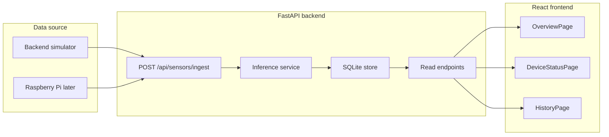

# Full ML Backend Frontend Integration

## 1. Goal and constraints

- Stop using mock data anywhere in the frontend.
- Keep the current `RandomForest` model (`App/rf_routine_model.pkl`) as the inference engine — no model changes.
- Architect the system so the future Raspberry Pi can replace the simulator without changing the frontend or the model.
- Persist alerts, inferences and sensor readings in SQLite so nothing resets on backend restart.
- All decisions documented in [DECISOES_LOCAIS.md](DECISOES_LOCAIS.md) in Portuguese.

## 2. Target architecture

Key idea the user should learn: the frontend never invents sensor data again. The backend owns ingestion, inference, history and devices. Today the simulator feeds it; tomorrow the Raspberry Pi feeds the same endpoint.

## 3. Backend changes

### 3.1 Add SQLite persistence

- New module [backend/app/services/db.py](backend/app/services/db.py) to open a SQLite connection at startup and run migrations.
- File location: `backend/data/eldercare.sqlite` (create `backend/data/` folder).
- Tables (simple, learning-friendly schema):
  - `sensor_readings(id, ts, payload_json)`
  - `inferences(id, ts, expected_activity, confidence, is_anomaly, reason, alert_created)`
  - `alerts(id, ts, title, description, severity)`
  - `devices(id, name, room, last_seen, battery, online)`
- Why SQLite: zero ops, single file, perfect for a school project. It will also teach the student the repository pattern.
- Wire up in [backend/app/main.py](backend/app/main.py) `lifespan`: `app.state.db = init_db(...)`.
- Migrate the existing in-memory `AlertStore` and `model_inference_store` to read/write from SQLite. Keep the same Python interfaces so callers don't change.

### 3.2 Sensor ingestion contract (Raspberry Pi-ready)

- New router [backend/app/routers/sensors.py](backend/app/routers/sensors.py) exposing:
  - `POST /api/sensors/ingest` — accepts a snapshot of readings and an optional `device_id`. Persists the row, updates devices table (`last_seen`, `battery`, `online=true`), then synchronously triggers inference and stores it.
  - `GET /api/sensors/latest` — returns the most recent reading plus enriched fields (CO2 status, temperature, last activity room).
  - `GET /api/sensors/history?hours=24` — returns hourly aggregates for `ActivityTrendsChart` (movement %, tempHum, CO2). This is the function that replaces the random chart data.
- Reuse the existing `_predict_from_model` function from [backend/app/routers/model.py](backend/app/routers/model.py) so the same logic that runs on `/infer` runs on every ingest.

### 3.3 Backend simulator (current data source)

- New service [backend/app/services/simulator.py](backend/app/services/simulator.py) running an `asyncio` task started in `lifespan`.
- Loop every 10 seconds: build a realistic `readings` payload (the same logic currently inside `OverviewPage.tsx` `SafetyStatusHeader`, moved to the backend), call the same code path as `/api/sensors/ingest` directly (no HTTP loopback).
- Toggle with env var `SIMULATOR_ENABLED=true|false` so when the Raspberry Pi arrives we just turn the simulator off.
- Why this design: the frontend code that today “fakes” readings (`OverviewPage.tsx`, lines 71-96) gets deleted; the same logic is moved server-side, where it truly belongs.

### 3.4 Devices and system metrics endpoints

- `GET /api/devices` — built from `devices` table; `online = (now - last_seen) < 60s`.
- `GET /api/system/metrics` — uses `psutil` on the backend host to expose CPU %, memory %, temperature (best effort), uptime. When the Raspberry Pi arrives, this becomes truly real for free.
- Add `psutil` to `backend/requirements.txt` (or pyproject if applicable).

### 3.5 Latest model state endpoint (Overview)

- Add `GET /api/model/latest` to [backend/app/routers/model.py](backend/app/routers/model.py): returns the most recent inference row from SQLite. The Overview page uses this instead of triggering inference itself.
- Keep `POST /api/model/infer` working for backwards compatibility and for the debug panel.

## 4. Frontend changes

### 4.1 New API client functions

- Extend [src/api/backend.ts](src/api/backend.ts) with:
  - `getLatestSensors()` -> `GET /api/sensors/latest`
  - `getSensorHistory(hours)` -> `GET /api/sensors/history`
  - `getDevices()` -> `GET /api/devices`
  - `getSystemMetrics()` -> `GET /api/system/metrics`
  - `getLatestInference()` -> `GET /api/model/latest`
- Add Zod-style typed responses (or plain TS types) so the components have strong typing.

### 4.2 OverviewPage cleanup ([src/pages/OverviewPage.tsx](src/pages/OverviewPage.tsx))

- `SafetyStatusHeader`: stop building `currentSensorData` on the client. Replace `useEffect`+`inferModel` with `useQuery({ queryKey: ['model-latest'], queryFn: getLatestInference, refetchInterval: 5000 })`. Keep the debug panel, but make it call `inferModel` directly (sandbox use case).
- `ResidentActivityCard`: replace `mockActivity` with `useQuery(['activity-recent'])` -> a new endpoint `GET /api/activity/recent` derived from sensor readings (PIR transitions, door open events).
- `EnvironmentalHealthCard`: derive `mockEnvMetrics` from `getLatestSensors()` (CO2, temperature, humidity).
- `DeviceStatusCard`: replace `mockDevices` with `getDevices()`.

### 4.3 DeviceStatusPage ([src/pages/DeviceStatusPage.tsx](src/pages/DeviceStatusPage.tsx))

- `RaspberryPiCard`: `getSystemMetrics()` (CPU, memory, temperature, uptime). Add a small disclaimer: while running locally, these are the dev machine metrics; once on Pi, they will be the device metrics.
- `ConnectedSensorsCard` and `AllDevicesCard`: `getDevices()`.

### 4.4 HistoryPage ([src/pages/HistoryPage.tsx](src/pages/HistoryPage.tsx))

- `ActivityTrendsChart`: lift the `chartData` `useState` initializer out and replace it with `useQuery(['sensor-history', 24], () => getSensorHistory(24))`. Keep the existing UX (overview vs single-metric tabs, normalized index for overview).
- `AirQualityGauge`: stop hardcoding `score={100}`. Compute a 0-200 score from current CO2 (tooltip: explain mapping in code comments).

### 4.5 Remove dead code

- Delete the `mockActivity`, `mockEnvMetrics`, `mockDevices`, `rpiMetrics`, `sensorCards`, `deviceRows` constants once their consumers are wired to real data.
- Delete the synthesized sensor logic at the top of `SafetyStatusHeader`.
- Keep the debug panel, but mark it clearly as a dev tool (already inside `DebugModeButton`).

## 5. Documentation and learning aids

- Update [DECISOES_LOCAIS.md](DECISOES_LOCAIS.md) (Portuguese) with:
  - decision: backend becomes single source of truth, simulator now, Raspberry Pi later;
  - decision: SQLite persistence, schema and rationale;
  - decision: split read endpoints from inference endpoint to keep the UI responsive and avoid duplicate ML work;
  - one short section per page explaining what was mocked before and what is now real.
- Add inline comments in the new files (`db.py`, `simulator.py`, `sensors.py`) explaining each step in plain language so the user can rewrite the code themselves.

## 6. Verification checklist

- `GET /health` returns ok.
- After 30 seconds with `SIMULATOR_ENABLED=true`:
  - SQLite has rows in `sensor_readings`, `inferences`, `devices`.
  - `GET /api/sensors/latest` returns recent values.
  - `GET /api/model/latest` returns an `expected_activity` and `confidence`.
- Frontend pages load with no `mock*` arrays in the codebase (`rg "mock" src` is empty).
- Restart backend: SQLite still has prior alerts and inferences; UI keeps working.

## 7. Suggested execution order (small commits)

1. SQLite layer + `init_db` + alerts/inferences migration (no UI change).
2. `POST /api/sensors/ingest` + simulator service + tests via `curl`.
3. `GET /api/sensors/latest` and `GET /api/model/latest` + wire `OverviewPage`.
4. `GET /api/sensors/history` + wire `ActivityTrendsChart` + fix `AirQualityGauge`.
5. `GET /api/devices` + `GET /api/system/metrics` + wire `DeviceStatusPage` and `DeviceStatusCard`.
6. `GET /api/activity/recent` + wire `ResidentActivityCard`.
7. Final cleanup of dead mocks + Portuguese decision notes.
