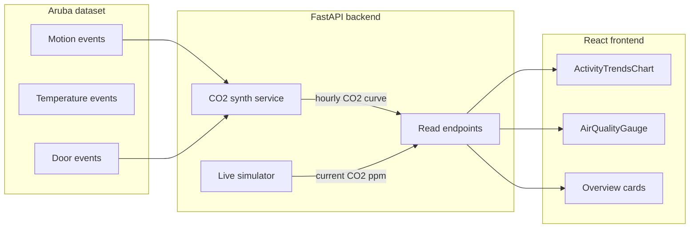

# Simulated CO2 Air Quality

## 1. Why Option B (live + synthetic history)

- The Aruba dataset has motion + temperature + activity labels, but no CO2 sensor.
- We want the dashboard to feel coherent (activity + temperature + CO2 visible together), but never lie to the user.
- So we generate CO2 from things we already know, and we mark it explicitly as "simulado" in the UI.

### Mental model

CO2 indoors behaves like a small physical model:

- baseline outdoors ~420 ppm
- people present -> CO2 rises (production)
- ventilation / doors open -> CO2 drops (decay)
- low activity -> CO2 slowly returns to baseline

That maps almost 1:1 to Aruba signals:

- production = motion intensity (`M*` events) and presence (occupancy)
- ventilation = door events (`D*`) and night hours
- decay = exponential return to baseline when nothing is happening

So we are not inventing CO2 from nothing. We are deriving it from a real behavior dataset, which is a defensible academic choice.

## 2. Architecture

Two distinct data flows:

- Historical CO2 is computed from Aruba aggregates (no DB writes, just an aggregation function).
- Live CO2 is a small stateful generator inside the simulator that reacts to current motion/door activity.

## 3. Implementation steps (small, learnable commits)

### Step 1: Add a small CO2 model module

- New file [backend/app/services/co2_model.py](backend/app/services/co2_model.py).
- Pure functions, no FastAPI here, easy to unit-test and easy to read.
- Two functions:
  - `co2_step(prev_ppm, motion_score, door_event, dt_minutes) -> floats`
    - Discrete step model, e.g.:
      - `production = base_production * motion_score`
      - `decay = (prev_ppm - baseline) * decay_rate * dt_minutes`
      - `vent = vent_boost if door_event else 0`
      - `next = clamp(prev - decay - vent + production + noise, 400, 2500)`
  - `co2_status(ppm) -> "Bom" | "Moderado" | "Mau"` (single source of truth for thresholds).
- Constants: `BASELINE_PPM = 420`, thresholds `800` and `1200`.
- Why: encapsulating the formula in one module teaches the “domain logic vs API” separation pattern.

### Step 2: Synthesize Aruba-aligned hourly CO2 curve

- Extend [backend/app/services/aruba_dataset.py](backend/app/services/aruba_dataset.py) with `aruba_co2_curve(project_root)`:
  - reuse the cached parsed dataset
  - compute, per hour:
    - `motion_score` from `M*` ON events (already used for movement)
    - `door_events` from `D*` events (already in dataset)
  - simulate 24 hours by walking `co2_step(...)` hour by hour
- Update `aruba_sensor_history(...)` to fill `co2` from this curve instead of `None`.
- Why: keeps history honest (still derived from real activity), but visually complete.

### Step 3: Live CO2 from the simulator

- Update [backend/app/services/simulator.py](backend/app/services/simulator.py):
  - keep last simulated `co2_ppm` in `app.state.simulator_state`
  - on each loop, compute `motion_score` from the same readings the simulator already builds
  - call `co2_step(...)` with `dt_minutes = interval_seconds / 60`
  - replace the random CO2 in the readings with the new value
- Why: the live CO2 now reacts to occupancy patterns instead of jumping randomly, so the Overview card and gauge feel coherent across refreshes.

### Step 4: Update endpoints

- `GET /api/sensors/history` returns numeric CO2 again.
- Reuse `co2_status` in:
  - [backend/app/routers/sensors.py](backend/app/routers/sensors.py) `_co2_status(...)`
  - [backend/app/routers/model.py](backend/app/routers/model.py) (currently has its own copy)
- This removes duplicate threshold logic and teaches “shared helpers”.

### Step 5: Frontend honesty + visuals

- [src/components/ActivityTrendsChart.tsx](src/components/ActivityTrendsChart.tsx):
  - revert the “Aruba sem CO2” badges
  - add a single `CO2 (simulado)` badge whenever CO2 is shown
- [src/pages/HistoryPage.tsx](src/pages/HistoryPage.tsx) -> `AirQualityGauge`:
  - keep using the live CO2 from `getLatestSensors()` (already wired)
  - add small "Simulado" tag near title when running with `SIMULATOR_ENABLED=true`
- Optional config flag in [src/api/backend.ts](src/api/backend.ts) read from a new `/api/system/info` (or a static client constant) to know whether CO2 is real or simulated. Keeping it static is fine for now.

### Step 6: Documentation

- Update [DECISOES_LOCAIS.md](DECISOES_LOCAIS.md) (Portuguese) explaining:
  - decisao: CO2 nao existe em Aruba; foi sintetizado a partir de movimento e portas;
  - racional: dashboard coerente sem inventar dados puros;
  - regra: tudo o que vem do gerador deve estar marcado como `simulado` no UI;
  - como substituir pelo Raspberry Pi quando disponivel (so trocar a fonte de CO2).

## 4. Suggested parameter values to start

- `BASELINE_PPM = 420`
- `MAX_PRODUCTION_PER_MIN = 6` (ppm/min at full motion)
- `DECAY_PER_MIN = 0.02` (2% of (current - baseline) per minute)
- `DOOR_VENT_PPM = 80` (instant decrement per door event)
- `NOISE_STD = 5`

Why these defaults: with ~24 hours of stepping, peaks land around 900-1300 ppm during meal/evening windows, baseline returns at night, which matches what residents would expect to see and falls within the existing Bom/Moderado/Mau thresholds.

## 5. Verification checklist

- `GET /api/sensors/history?hours=24` returns 24 numeric `co2` values, with a visible peak around meal/evening hours.
- `GET /api/sensors/latest` returns a CO2 value that changes smoothly over time (no jumps).
- Overview gauge and history chart both render CO2 with `Simulado` label.
- `rg "co2: null" -g "*.tsx" src` returns nothing.

## 6. Out of scope (explicit)

- No model retraining: the RandomForest still works on Aruba routine features only.
- No Raspberry Pi wiring: when it arrives, only the live CO2 source is replaced; the rest stays unchanged.

